# CopyBoard v2.11.0

> **Gelişmiş Pano Yöneticisi, Ekran Görüntüsü Aracı ve OCR (Resimden Yazıya Çevirme) Uygulaması**


CopyBoard, günlük iş akışınızı hızlandırmak ve verimliliğinizi artırmak için tasarlanmış modern bir üretkenlik aracıdır. Pano geçmişinizi yönetin, ekran görüntüleri alın, videolar kaydedin ve resimlerdeki yazıları anında metne dönüştürün.

<p align="center">
  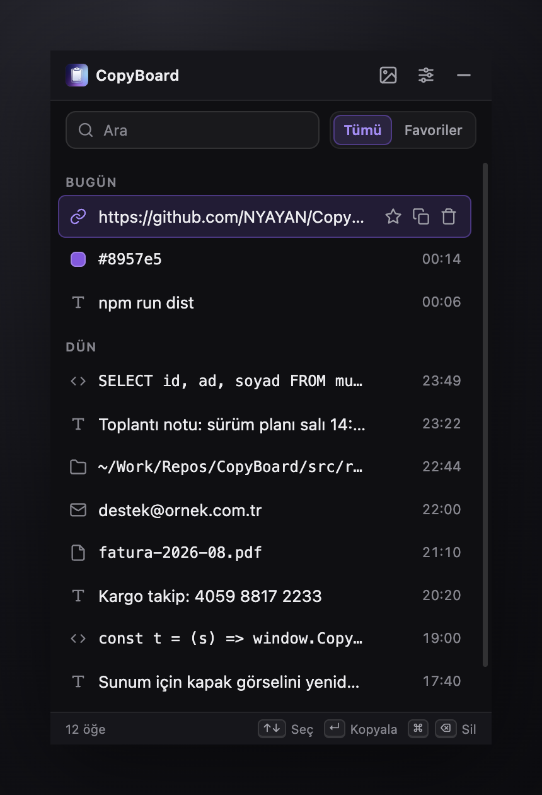
  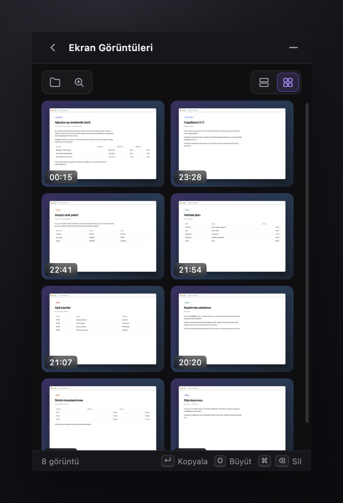
  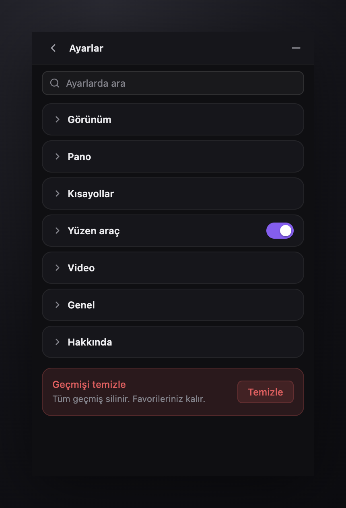
</p>

> Tüm ekranlar için: **[📸 Ekran Görüntüleri](#-ekran-görüntüleri)**

---

## ✨ Özellikler

### 📋 1. Gelişmiş Pano Yöneticisi
- **Otomatik Kayıt:** Kopyaladığınız her metin otomatik olarak geçmişe kaydedilir.
- **Arama:** Geçmiş kayıtları arasında anında arama yapın.
- **Geçmiş Temizleme:** İşiniz bittiğinde geçmişi tek tıkla temizleyin (Favorileriniz güvende kalır!).

### ⭐ 2. Favoriler ve Notlar
- **Sabitleme:** Sık kullandığınız metinleri "Favoriler" sekmesine ekleyin.
- **Not Ekleme:** Favori öğelerinize özel notlar ekleyerek (örn: "Müşteri Mail Taslağı") içeriği hatırlamanızı kolaylaştırın.
- **Sürükle-Bırak:** Favori listenizi dilediğiniz gibi sürükleyip bırakarak sıralayın.

### ⚡ 3. Hızlı Yapıştır
- **İmlecin Yanında:** `Cmd / Ctrl + Shift + V` ile son kopyaladıklarınız imlecin dibinde açılır.
- **Doğrudan Yapıştırma:** Seçtiğiniz öğe, o an yazdığınız alana kendiliğinden yapıştırılır — pencere değiştirmeden.
- **Liste Uzunluğu:** Kaç öğe görüneceğini ayarlardan belirleyin (varsayılan 20).

> macOS'ta otomatik yapıştırma **Erişilebilirlik** izni ister; ayrıntı aşağıdaki **Kurulum** bölümünde.

### 📸 4. Ekran Alıntısı Aracı (Snipping Tool)
- **Hızlı Seçim:** Ekranın dilediğiniz bölümünü seçin.
- **Çizim Araçları:**
  - ✏️ **Kalem:** Serbest çizim yapın.
  - ⬜ **Şekiller:** Kare, Daire ve Ok işaretleri ekleyin.
  - 📝 **Metin:** Görüntü üzerine notlar yazın.
  - 🌫️ **Blur (Bulanıklaştırma):** Hassas bilgileri (şifre, kimlik vb.) sansürleyin.
- **Kopyalama & Kaydetme:** Görüntüyü direkt panoya kopyalayın (`Ctrl+C`) veya PNG olarak kaydedin.

### 📜 5. Kaydırmalı Yakalama (Scrolling Capture)
- **Ekrana Sığmayanı Yakalayın:** Uzun bir web sayfasını, sohbeti veya belgeyi tek bir görüntüde birleştirin.
- **Nasıl Çalışır:** Alanı seçip **Başlat**'a basın, ardından uygulamayı her zamanki gibi kendiniz kaydırın. CopyBoard kareleri örtüşmelerinden birleştirir; kaydırmayı bırakınca kendiliğinden biter.
- **Yapışkan Başlık/Altlık:** Sayfayla birlikte kaymayan sabit başlık ve araç çubukları tanınır — sonuçta tekrar tekrar basılmaz, bir kez görünürler.
- **Dürüst Uyarı:** Bir kare güvenle eşleşmezse birleştirilmez; sonunda kaç karenin atlandığı size söylenir. Çok hızlı kaydırırsanız uyarı çıkar.

### 🎥 6. Video Ekran Kaydı
- **Esnek Kayıt:** İster tam ekran, isterseniz sadece seçtiğiniz belirli bir alanın videosunu çekin.
- **Format:** WebM formatında yüksek kaliteli kayıtlar alın.
- **Kalite Seçenekleri:** Yüksek, Orta veya Düşük kalite ayarları.
- **Ses:** Mikrofon ve sistem sesi ayrı ayrı açılıp kapatılabilir.

### 🔍 7. Gelişmiş OCR (Optik Karakter Tanıma)
- **Metin Tanıma:** Ekranda gördüğünüz herhangi bir yazıyı (resim, PDF, video karesi vb.) seçerek anında metne dönüştürün.
- **Dil Desteği:** Türkçe ve İngilizce metinleri yüksek doğrulukla tanır.
- **Otomatik Kopyalama:** Tanınan metin otomatik olarak panoya kopyalanır.

### 🎨 8. Renk Kodu Alma (Eyedropper)
- **Büyüteçli Seçim:** Ekranın herhangi bir yerindeki pikseli büyüteçle nişanlayın.
- **Tek Tıkla Kopyalama:** Tıkladığınız pikselin hex kodu (`#8957e5`) doğrudan panoya gider.
- **Alıntı Aracının İçinden de:** Ekran alıntısı sırasında `C` tuşu, büyütecin altındaki rengi kopyalar.

### 🖼️ 9. Ekran Görüntüleri Galerisi
- **Tek Yerde:** Kaydettiğiniz görüntüler uygulamanın içindeki galeride toplanır; tek veya iki sütunlu ızgara arasında geçiş yapın.
- **Büyük Görüntüleyici:** Görüntüyü büyütün, üzerine çizin, kırpın; alttaki şeritten diğerlerine geçin.
- **Karşılaştırma:** `Karşılaştır`a bastıktan sonra şerit gezinmeye açık kalır: bir küçük resme tıklayınca **büyük hali sahnede açılır** (`←`/`→` ile de gezinirsiniz), beğendiğinizi **Karşılaştırmaya ekle** düğmesiyle ya da küçük resmin köşesindeki `+` ile eklersiniz — eklenenler sıra numarasıyla işaretlenir. İki ila beş resim eklenince (beşi bir ekranda okunur kalanın sonu) `Karşılaştır` yan yana koyar: hepsi **yatay** tek sırada (varsayılan), **2'li** ya da **4'lü** gösterilir, panelleri başlığından sürükleyerek sıralarsınız. Yakınlaştırma **her panel için ayrı**: bir resme tıklamak ya da üzerinde `Ctrl/Cmd`+tekerlek çevirmek yalnızca o paneli ölçekler. Araç çubuğundaki yakınlaştırma kontrolü ile `Ctrl/Cmd ±` **hepsini birlikte** aynı ölçeğe getirir.
- **Dosyaya Erişim:** Görüntüyü panoya kopyalayın, klasörde gösterin veya galeriden silin.

### 🌟 10. Yüzen Kısayol Aracı (Floating Widget)
- **Hızlı Erişim:** Masaüstünüzde her an elinizin altında duran, dilediğiniz köşeye yaslanabilen akıllı yüzen araç.
- **Tek Tıkla Araçlar:** Pano, Ekran Yakalama, OCR, Kaydırmalı Yakalama ve Video Kaydı araçlarına klavye kısayolu kullanmadan anında ulaşın.
- **Gömülü Pano Paneli:** Geçmiş ve favoriler, ana pencereyi açmadan aracın yanında açılır.
- **Görünüm Ayarları:** Rengini, saydamlığını ve boyutunu ayarlardan değiştirin.
- **Nasıl Açılır?:** Uygulamanın ayarlar menüsüne girip "Yüzen Araç (Widget)" seçeneğini işaretlemeniz yeterlidir. Ardından fare ile dilediğiniz yere sürükleyebilirsiniz.

### 🎛️ 11. Tema ve Dil
- **Tema:** Koyu, açık veya işletim sisteminin ayarını izleyen mod. Değişiklik anında uygulanır.
- **Dil:** Türkçe ve İngilizce arayüz.

### 🔄 12. Otomatik Güncelleme
- Uygulama başlangıcında otomatik güncelleme kontrolü.
- Yeni sürümlerin arka planda indirilmesi ve tek tıkla kurulumu.

---

## 📸 Ekran Görüntüleri

Aşağıdaki görüntüler uygulamanın kendi arayüz kodundan üretilmiştir; içerikleri örnek veridir.

### 📋 Pano

<table>
  <tr>
    <td width="33%"><br><sub><b>Geçmiş</b> — kopyalanan her şey türüne göre işaretlenip günlere ayrılır.</sub></td>
    <td width="33%">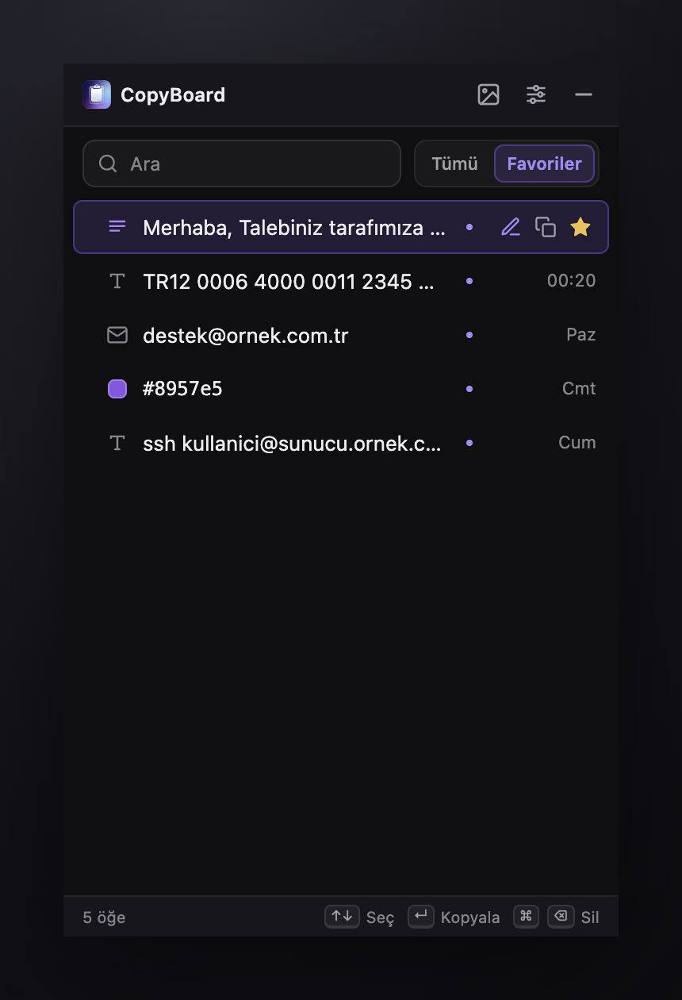<br><sub><b>Favoriler</b> — sabitlenen metinler, sürükleyip bırakarak sıralanır.</sub></td>
    <td width="33%">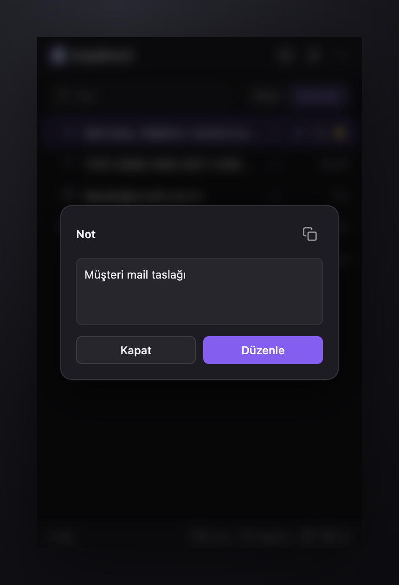<br><sub><b>Not</b> — favori bir öğeye ne olduğunu hatırlatan bir not eklenir.</sub></td>
  </tr>
  <tr>
    <td>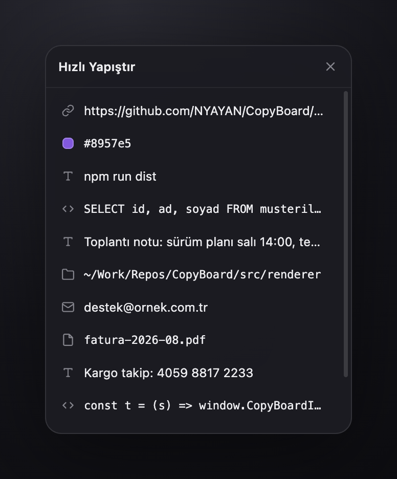<br><sub><b>Hızlı Yapıştır</b> — imlecin yanında açılır, seçtiğiniz öğe odaktaki alana yapıştırılır.</sub></td>
    <td>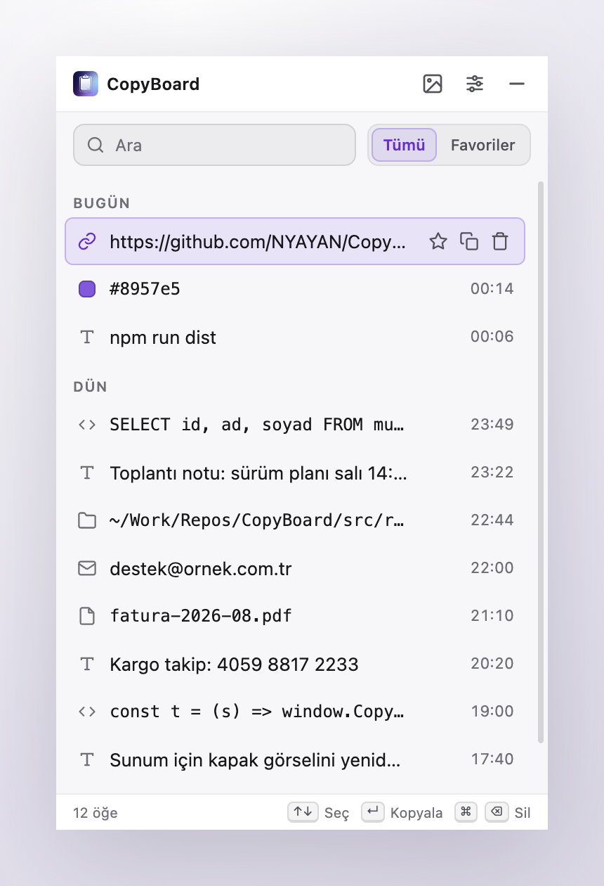<br><sub><b>Açık tema</b> — koyu, açık veya sistemi izleyen mod.</sub></td>
    <td>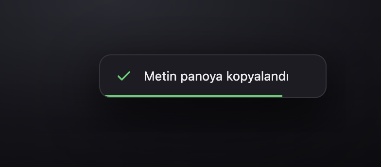<br><sub><b>Bildirim</b> — işlem sonucu köşede kısa bir bilgi olarak belirir.</sub></td>
  </tr>
</table>

### 📸 Ekran alıntısı, OCR ve kayıt

<p align="center">
  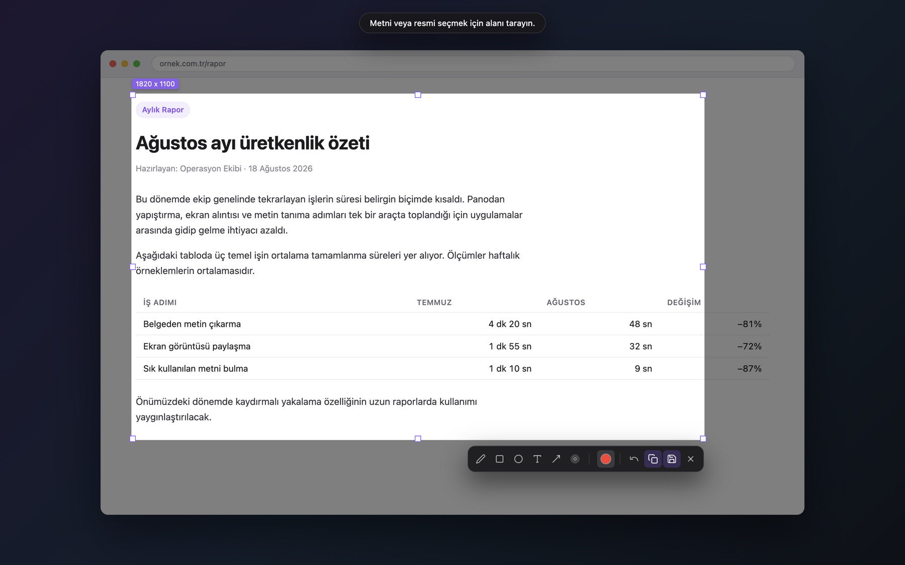<br>
  <sub><b>Ekran alıntısı</b> — alanı seçin, üzerine çizin, panoya kopyalayın veya PNG olarak kaydedin.</sub>
</p>

<p align="center">
  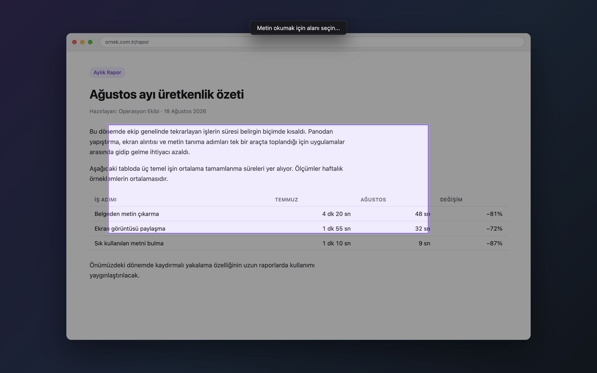<br>
  <sub><b>OCR</b> — seçtiğiniz alandaki yazı Türkçe ve İngilizce tanınıp panoya kopyalanır.</sub>
</p>

<p align="center">
  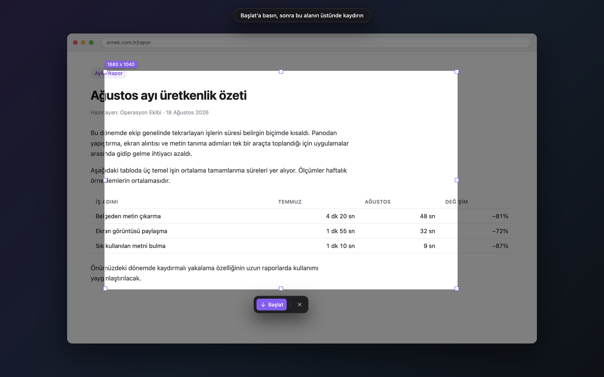<br>
  <sub><b>Kaydırmalı yakalama</b> — alanı seçip Başlat'a basın, sayfayı kendiniz kaydırın; kareler birleştirilir.</sub>
</p>

<table>
  <tr>
    <td width="50%">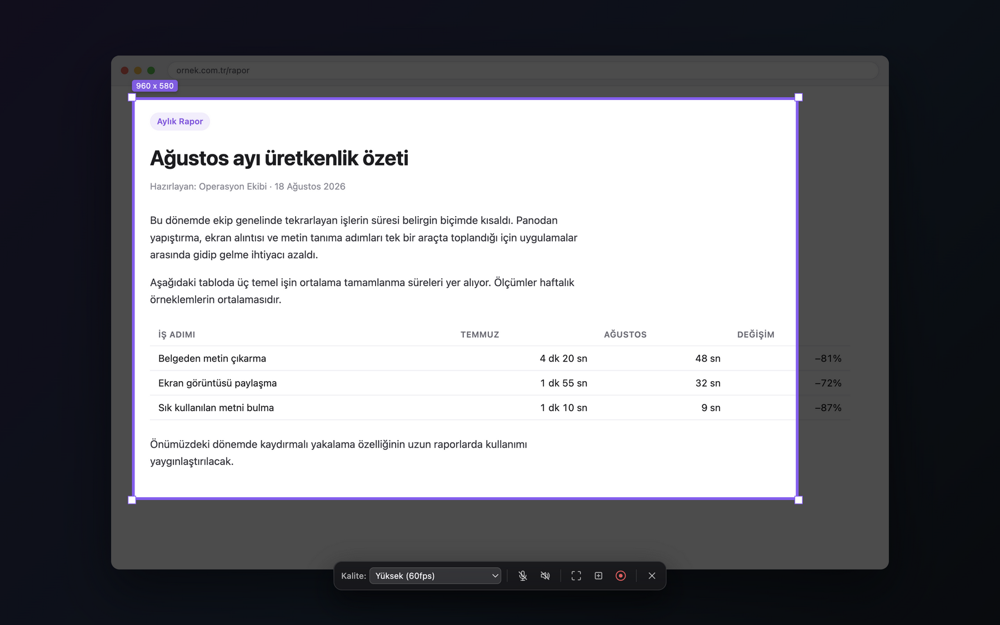<br><sub><b>Video kaydı</b> — tam ekran ya da seçili alan, mikrofon ve sistem sesi seçenekleriyle.</sub></td>
    <td width="50%">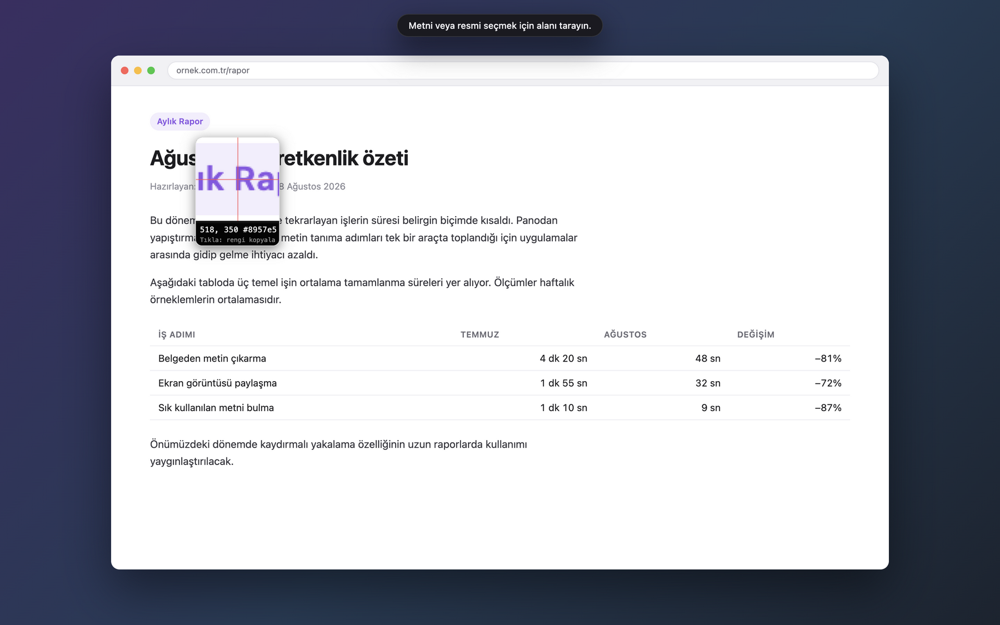<br><sub><b>Renk kodu al</b> — büyüteçle pikseli seçin, hex kodu panoya gitsin.</sub></td>
  </tr>
</table>

### 🖼️ Galeri ve görüntüleyici

<table>
  <tr>
    <td width="33%"><br><sub><b>Galeri</b> — alınan görüntüler tek veya iki sütunlu ızgarada toplanır.</sub></td>
    <td width="67%">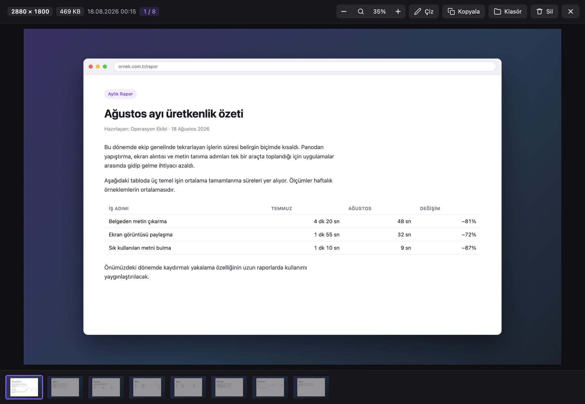<br><sub><b>Görüntüleyici</b> — büyütün, üzerine çizin, kopyalayın; alttaki şeritten diğerlerine geçin.</sub></td>
  </tr>
</table>

### 🌟 Yüzen araç (Widget)

<table>
  <tr>
    <td width="25%">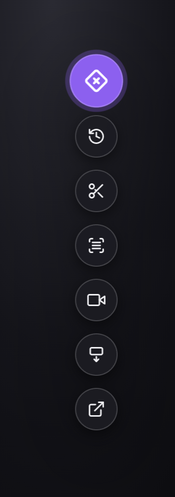<br><sub><b>Araçlar</b> — kısayol kullanmadan tek tıkla erişim.</sub></td>
    <td width="75%">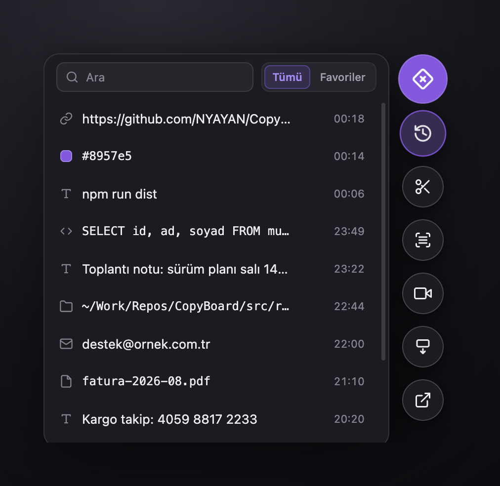<br><sub><b>Pano paneli</b> — geçmiş ve favoriler, ana pencereyi açmadan elinizin altında.</sub></td>
  </tr>
</table>

### ⚙️ Ayarlar ve güncelleme

<table>
  <tr>
    <td width="33%"><br><sub><b>Ayarlar</b> — başlıklar açılıp kapanır, arama kutusu ayarı bulur.</sub></td>
    <td width="33%">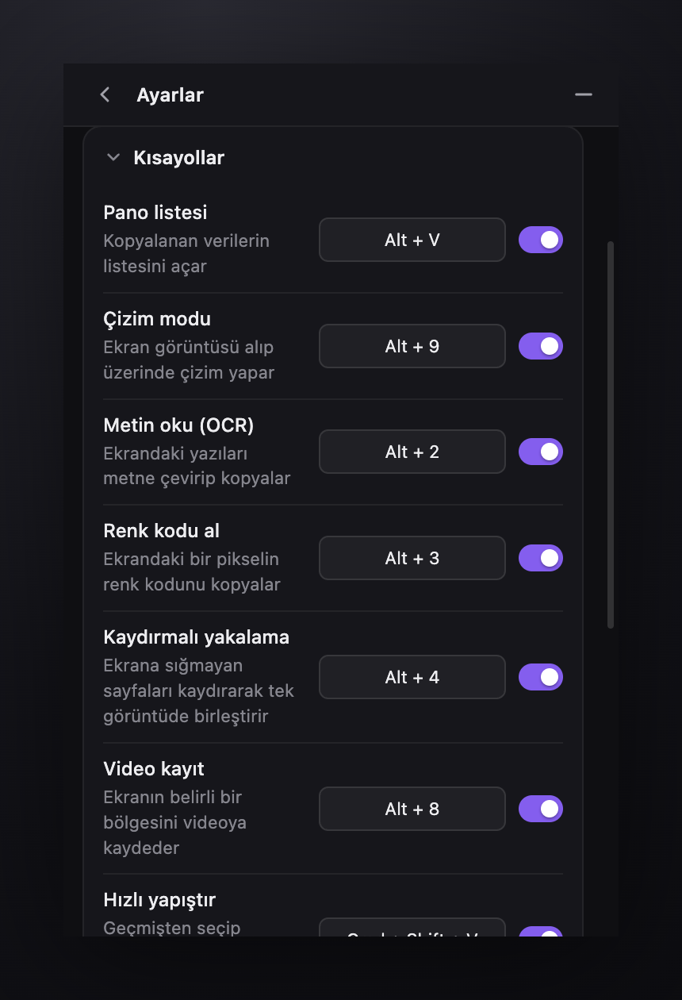<br><sub><b>Kısayollar</b> — her biri yeniden tanımlanabilir, tek tek açılıp kapatılabilir.</sub></td>
    <td width="33%">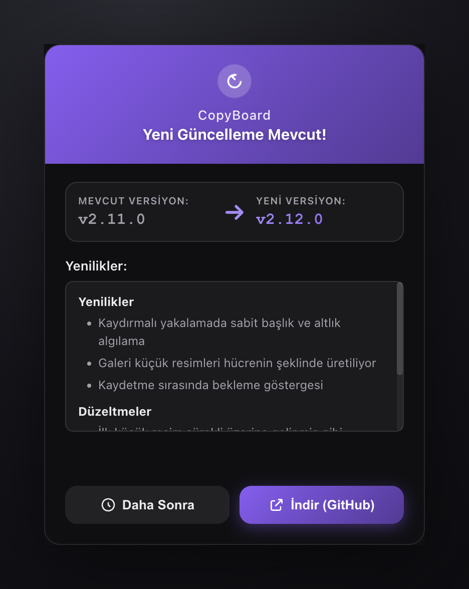<br><sub><b>Güncelleme</b> — yeni sürüm bulunduğunda notlarıyla birlikte sunulur.</sub></td>
  </tr>
</table>

---

## ⌨️ Kısayollar

### Genel (her yerden çalışır)

| Kısayol | İşlev | Açıklama |
|---------|-------|----------|
| `Alt / Option + V` | **Pano Listesi** | Pano geçmişi ve favoriler penceresini açar. |
| `Cmd / Ctrl + Shift + V` | **Hızlı Yapıştır** | İmlecin yanında açılır, seçtiğiniz öğeyi odaktaki alana yapıştırır. |
| `Alt / Option + 9` | **Ekran Görüntüsü** | Ekran alıntısı aracını başlatır. |
| `Alt / Option + 8` | **Video Kaydı** | Video kaydı arayüzünü açar. |
| `Alt / Option + 2` | **OCR (Metin Oku)** | Ekrandan metin okuma aracını başlatır. |
| `Alt / Option + 3` | **Renk Kodu Al** | Ekrandaki bir pikselin renk kodunu kopyalar. |
| `Alt / Option + 4` | **Kaydırmalı Yakalama** | Uzun sayfaları kaydırarak tek görüntüde birleştirir. |

> **Not:** Bu kısayolların hepsi ayarlardan yeniden tanımlanabilir ve tek tek kapatılabilir.

### Pano listesinde

| Kısayol | İşlev |
|---------|-------|
| Yazmaya başlayın | Listede arar |
| `↑` `↓` `PgUp` `PgDn` `Home` `End` | Öğeler arasında gezinir |
| `Enter` | Kopyalar ve pencereyi kapatır |
| `Cmd / Ctrl + Enter` | Kopyalar ama pencere açık kalır (arka arkaya toplamak için) |
| `Cmd / Ctrl + D` | Favorilere ekler / çıkarır |
| `Cmd / Ctrl + Backspace` | Seçili öğeyi siler |
| `ESC` | Pencereyi gizler |

### Galeride

| Kısayol | İşlev |
|---------|-------|
| `←` `→` `↑` `↓` `Home` `End` | Görüntüler arasında gezinir |
| `Enter` | Görüntüyü panoya kopyalar |
| `O` | Büyük görüntüleyicide açar |
| `Cmd / Ctrl + Backspace` | Görüntüyü siler |

### Ekran alıntısı aracında

| Kısayol | İşlev |
|---------|-------|
| `Cmd / Ctrl + C` veya `Enter` | Seçili alanı panoya kopyalar |
| `Cmd / Ctrl + Z` | Son çizimi geri alır |
| `C` | Büyütecin altındaki rengi kopyalar |
| `ESC` | Araçtan çıkar |

### Büyük görüntüleyicide

| Kısayol | İşlev |
|---------|-------|
| `←` `→` | Önceki / sonraki görüntü |
| `Cmd / Ctrl + +` `-` | Yakınlaştırır / uzaklaştırır |
| `Cmd / Ctrl + 0` | Pencereye sığdırır |
| `Cmd / Ctrl + 1` | Gerçek boyuta döner |
| `ESC` | Bir adım geri alır (kırpma, çizim, karşılaştırma); son adımda pencereyi kapatır |

---

## 🚀 Kurulum (Kullanıcılar İçin)

1. **[Releases](https://github.com/NYAYAN/CopyBoard/releases)** sayfasından işletim sisteminize uygun sürümü indirin:
   - **Windows:** `CopyBoard-Setup-2.11.0.exe`
   - **macOS (Apple Silicon):** `CopyBoard-2.11.0-arm64.dmg`

   *Dosya adındaki sürüm numarası her yayınla değişir; Releases sayfasındaki en yeniyi alın.*
2. İndirdiğiniz dosyayı çalıştırın (macOS'te uygulamayı `Applications` klasörüne sürükleyin).
3. Kurulum tamamlandığında uygulama otomatik olarak başlayacak ve sistem tepsisine (saat yanı) yerleşecektir.

> **⚠️ macOS Kullanıcıları İçin Önemli Not:**
> Eğer uygulama "Geliştirici doğrulanamadı" veya "Hasarlı" hatası verirse, Terminal'i açıp şu komutu uygulayın:
> ```bash
> sudo xattr -rd com.apple.quarantine /Applications/CopyBoard.app
> ```
> *Komutu girdikten sonra şifrenizi girmeniz gerekebilir.*

> **⌨️ macOS'te Hızlı Yapıştır İzni:**
> Hızlı Yapıştır'ın seçtiğiniz öğeyi odaktaki metin alanına **otomatik yapıştırabilmesi** için macOS'un
> **Erişilebilirlik** iznine ihtiyacı vardır (Windows'ta böyle bir izin gerekmez). İlk kullanımda CopyBoard
> bu izni sizden kendisi ister — "Open System Settings" düğmesine basıp CopyBoard'u açmanız yeterli.
> **İzni verdikten sonra CopyBoard'u kapatıp yeniden açın**; macOS verilen izni zaten çalışmakta olan bir
> uygulamaya uygulamaz. İzin verilmezse öğe yine de panoya kopyalanır, `Cmd+V` ile elle yapıştırabilirsiniz.

---

## 🛠 Geliştirici Kılavuzu

Proje modern bir mimariye taşınmış ve modüler hale getirilmiştir.

> **v3.0.0'dan itibaren ana süreç Rust'ta (Tauri).** Arayüz (`src/renderer/`) aynı kaldı;
> `window.api` köprüsü Electron'un preload'u yerine `src/renderer/shared/api-tauri.js`
> üzerinden Tauri komutlarına bağlanıyor. Electron sürümü geri dönüş için depoda
> duruyor (`src/main/`, `npm run start:electron`).

### Gereksinimler
- **Rust** (stable) — [rustup](https://rustup.rs) ile
- **Node.js** 18.17+ veya 20+ (testler için Node 21+, aşağıya bakın)
- **npm**
- **CMake** — OCR motoru (`tesseract-rs`) kaynaktan derleniyor
- **macOS için:** Xcode Command Line Tools

  Electron'un adlandıramadığı fiziksel tuşlar (Esc altındaki ISO tuşu, JIS tuşları)
  artık yerel bir N-API eklentisi gerektirmiyor: Carbon `RegisterEventHotKey` doğrudan
  Rust'tan çağrılıyor (`src-tauri/src/platform/macos/hotkey_carbon.rs`).

### Proje Yapısı
```
src-tauri/             # Ana süreç (Rust / Tauri) — v3.0.0'dan itibaren
├── src/
│   ├── windows/       # Pencere kurulumu, yerleşim, tıklama geçirgenliği
│   ├── commands/      # Renderer'a açılan IPC komutları
│   ├── clipboard/     # Pano izleyici + geçmiş/favoriler
│   ├── capture/       # Ekran görüntüsü, video, kaydırmalı yakalama
│   ├── platform/      # macOS / Windows'a özgü katman (pano, yapıştırma, kısayol)
│   ├── shortcuts/     # Global kısayol kaydı ve accelerator çevirisi
│   └── lib.rs         # Uygulama kurulumu
└── tauri.conf.json    # Pencere, güvenlik (CSP), paketleme ayarları

src/
├── main/              # Backend (Electron Main Process — geri dönüş için duruyor)
│   ├── services/      # Ayrıştırılmış Servisler (State, Window, Tray, Tema, i18n vb.)
│   │   └── ipc/       # Konularına ayrılmış IPC işleyicileri
│   └── main.js        # Ana giriş noktası
├── renderer/          # Frontend (Electron Renderer Process)
│   ├── main-window/   # Ana Pano Arayüzü (ES Modules + modules/ alt klasörü)
│   ├── widget/        # Yüzen Araç (Floating Widget)
│   ├── quickpaste/    # Hızlı Yapıştır Seçicisi
│   ├── snipper/       # Ekran Alıntısı Aracı (+ renk seçici modu)
│   ├── ocr/           # OCR Aracı
│   ├── recorder/      # Video Kaydedici
│   ├── scroller/      # Kaydırmalı Yakalama (+ birleştirme algoritması)
│   ├── viewer/        # Büyük Ekran Görüntüsü Görüntüleyici
│   ├── update/        # Güncelleme Penceresi
│   ├── toast/         # Bildirim (Toast)
│   └── shared/        # Ortak Varlıklar (tokens.css, i18n, içerik türü, cursor)
├── shared/i18n/       # Çeviri sözlükleri (en.json)
└── preload/           # Preload Scriptleri (yalnız Electron yolu)

native/mac-hotkey/     # macOS yerel kısayol eklentisi (yalnız Electron yolu)
scripts/               # Yardımcı betikler (yerel derleme, imzalama, ekran görüntüsü)
test/                  # node:test birim testleri + Electron kontrol betikleri
docs/                  # Göç planı, spike ölçümleri, ekran görüntüleri
```

> `src/renderer/` içindeki alt klasörler (`main-window/`, `widget/`, `quickpaste/`,
> `snipper/`, `ocr/`, `recorder/`, `scroller/`, `viewer/`, `update/`, `toast/`,
> `shared/`) iki sürümde de ORTAK — göç sırasında yalnız dördü değişti.

### Kurulum ve Çalıştırma

1. **Repoyu klonlayın:**
   ```bash
   git clone https://github.com/NYAYAN/CopyBoard.git
   cd CopyBoard
   ```

2. **Bağımlılıkları yükleyin:**
   ```bash
   npm install
   ```

3. **Geliştirme modunda başlatın:**
   ```bash
   npm run dev
   ```
   *İlk çalıştırma Rust bağımlılıklarını derlediği için birkaç dakika sürer; sonrakiler
   saniyeler içinde açılır. Electron sürümünü çalıştırmak için `npm run start:electron`.*

4. **Testleri çalıştırın:**
   ```bash
   npm test
   ```
   *Arayüz testleri. `node --test`'in glob desteğini kullandığı için **Node 21+** ister.*

   ```bash
   npm run test:rust
   ```
   *Ana sürecin birim testleri (yerleşim, pano, mağaza, kısayol çevirisi, OCR).*

5. **Production Build (Setup) oluşturun:**
   ```bash
   npm run build
   ```
   *macOS'ta `.app` + `.dmg`, Windows'ta `.msi` + `.exe` üretir; çıktı
   `src-tauri/target/release/bundle/` altında. İmzalama ve notarizasyon için
   `SIGNING.md`, sürüm akışı için `RELEASE_GUIDE.md`.*

6. **README'deki ekran görüntülerini yeniden üretin:**
   ```bash
   npm run screenshots
   ```
   *Arayüz değiştiğinde `docs/screenshots/` klasörünü baştan yazar. Uygulamanın gerçek
   pencerelerini örnek veriyle açıp yakalar — sizin panonuza, ekran görüntülerinize veya
   ayarlarınıza dokunmaz. Kareler ekranın piksel yoğunluğuyla üretildiği için en iyi
   sonucu Retina/HiDPI bir ekranda verir; satırlardaki saatler her koşuda tazelenir.*

---

## 👤 Yapımcı

**Nurullah YAYAN**
- 📧 E-posta: nurullah.yayan@gmail.com
- 🐙 GitHub: [NYAYAN](https://github.com/NYAYAN)

---

## 📝 Lisans

Bu proje **ISC** lisansı ile lisanslanmıştır. Detaylar için `LICENSE` dosyasına bakabilirsiniz.
